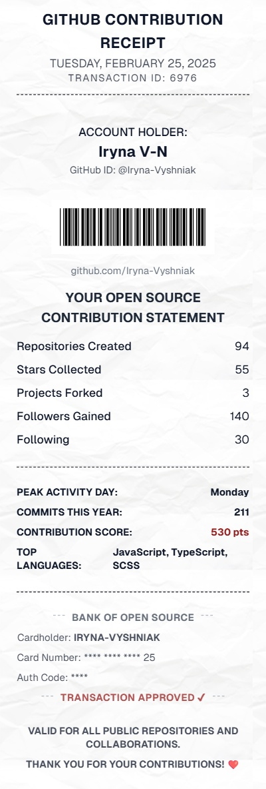
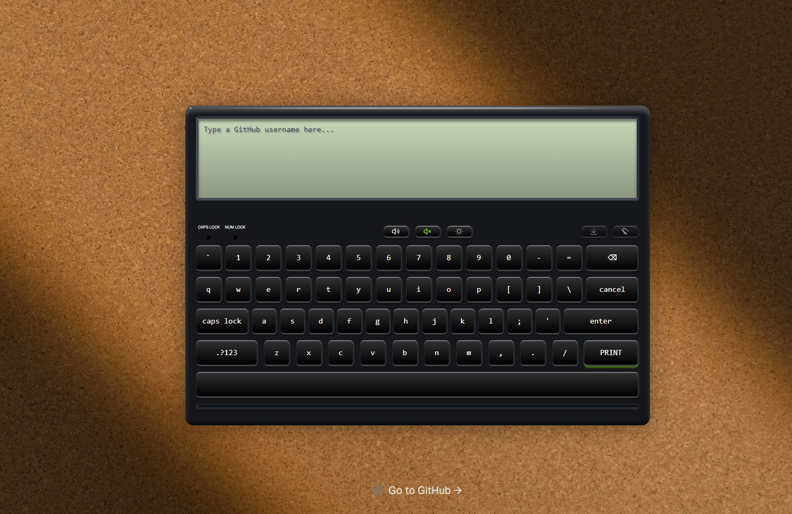
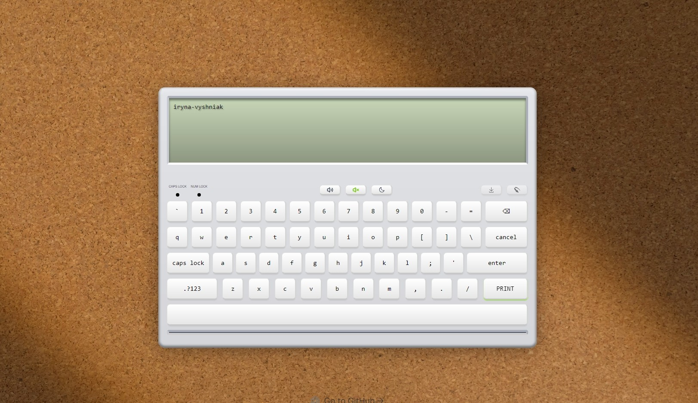

# 📊 GitHub Report

GitHub Report is a **Next.js & React** app that generates a **printable GitHub contribution summary**. Using **GitHub API, html-to-image, and jsbarcode**, it creates a visually appealing report with key statistics such as repositories, stars, forks, and commits.

---

## 🚀 Features

- 🔄 **Dynamic Data Fetching** – Retrieves user data from GitHub API.
- 🏷 **Barcode Generation** – Encodes GitHub usernames into barcodes.
- 🖼 **Export Options** – Save your report as an image or share it.
- 🎨 **Styled as a Receipt** – Unique transaction-style contribution summary.
- ♿ **Accessibility Optimizations** – Semantic HTML and ARIA attributes.
- 🌙 **Dark Mode Support** – Adapts to system theme.

---

## 📦 Tech Stack

- **Next.js 15** – Server-side rendering & API routes.
- **React 19** – Component-based UI.
- **GitHub API** – Fetches user contribution stats.
- **html-to-image** – Converts reports to images.
- **jsbarcode** – Generates barcodes.
- **Tailwind CSS** – Responsive and modern styling.

---

## 🛠 Installation

1. **Clone the repository**

   ```sh
   git clone https://github.com/Iryna-Vyshniak/github-report.git
   cd github-report
   ```

2. **Install dependencies**

   ```sh
   npm install
   ```

   _or_

   ```sh
   yarn install
   ```

3. **Set up environment variables**

   - Create a `.env.local` file and add the following:
     `env
NEXT_PUBLIC_GITHUB_API=https://api.github.com/users/
NEXT_PUBLIC_REPOS_URL=https://api.github.com/repos/
NEXT_PUBLIC_COMMITS_URL=https://api.github.com/search/commits?q=author:
NEXT_PUBLIC_GITHUB_TOKEN=your token
`

4. **Run the development server**
   ```sh
   npm run dev
   ```
   _or_
   ```sh
   yarn dev
   ```

---

## 📸 Screenshots





---

## 📜 Usage

1. Enter a **GitHub username**.
2. Click the **Print button** to generate the report.
3. View your **GitHub contribution summary**.
4. **Download** or **share** your report as an image.

---

## 📌 Roadmap

- [ ] Add **multi-language support** 🌍
- [ ] Allow **custom styling** for receipts 🎨
- [ ] Improve **mobile responsiveness** 📱
- [ ] Implement **PDF export option** 📝

---

## 🤝 Contributing

Contributions are welcome! 🎉 If you'd like to improve the project:

1. **Fork the repo**
2. **Create a feature branch** (`git checkout -b feature-name`)
3. **Commit your changes** (`git commit -m 'Add some feature'`)
4. **Push to the branch** (`git push origin feature-name`)
5. **Open a Pull Request** 🚀

---

## 📜 License

MIT License © [Iryna-Vyshniak](https://github.com/Iryna-Vyshniak)

---

## 💡 Inspiration

Inspired by the concept of **gamifying open-source contributions**, this project turns GitHub activity into a **receipt-style report** for a fun and interactive experience. 🚀
